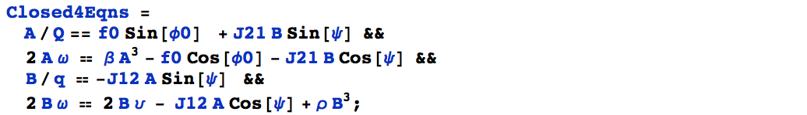
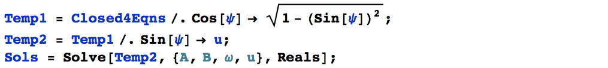
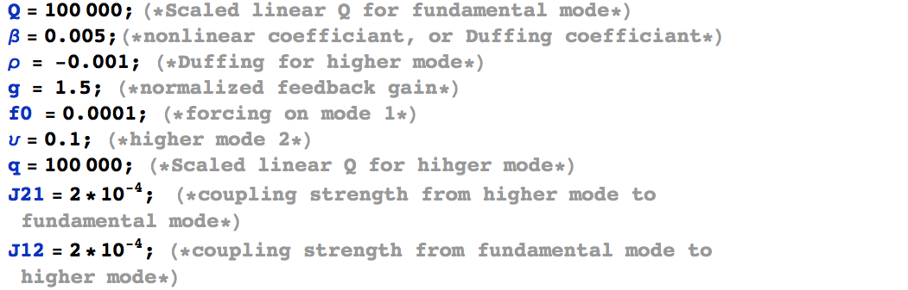
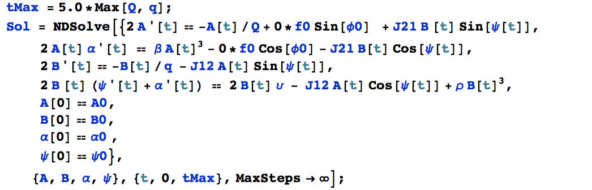

# Mathematica simulations
The purpose of this document is to serve as the "manual" for running `Mathematica` scripts that I've written. The scripts include solutions for both steady-states (s.s.) and trainsient (or otherwise known as ringdown). Depending on the exact version of the scripts, there might be some minor difference, however, I will try to highlight the major logic flow, *i.e.*, pseudocode, here. All the codes and simulation results are under the path `root/nonlinear MEMS/IR model paper/ringdown query 1to1 model`, where `root` folder can be defined externally if the files are moved. Currently, `master = /Users/changyaochen/Box Sync/Papers`.

## Steady-state 

In order to simulate transient response properly, it is important to give the system the "proper" starting points, *i.e.*, initial conditions. Seeing this from a bigger picture, it is just to give the ODEs (here the derivatives are taken with respective to time) the ***required*** initial conditions. In our specifice case, the governing ODEs are:
$$
2\dot{A} = -Q^{-1}(A + \zeta A^3) + f_0 \sin{\Delta} + JB\sin{\eta},
$$$$
2A\omega = \beta A^3 - f_0\cos{\Delta} - JB\cos{\eta},
$$$$
2\dot{B} = -q^{-1}B - J'A\sin{\eta},
$$$$
2B(\dot{\eta} + \omega) = 2\nu B - J'A\cos{\eta} + \rho B^3.
$$
These 4 equations are at the center of all the `Mathemactia` simulations. The exact symbols might differ from time to time, for example, here I use $\eta$ to denote the phase difference between the two modes, whereas in the actual `Mathematica` scripts, I might be using the symbol $\psi$. One important thing to note here is that, we need clearly distinguish what are the "variables" (we solve for their values) and "parameters" (we assign their values) in these ODEs. In the above ODEs, the 4 variables are $A, B, \omega, \eta$ (which makes sense since we have 4 equations), and the rest are all parameters, whose values correspond to the system characteristics. In the above ODEs, the parameters are $Q, q$ (quality factors for mode 1 and mode 2), $\zeta$ (nonlinear damping for mode 1), $f_0$ (amplitude of feedback force), $\Delta$ (phase-delay of feedback force), $\beta, \rho$ (Duffing nonlinear coefficiants for mode 1 and mode 2), $J, J'$ (coupling coefficiants), $\nu$ (frequency offset between the linear resonance of mode 2 to mode 1).

The steady-state is defined as the first-order time-derivatives are zero: it simply means things are not changing, hence, "steady". In our case, it means $\dot{A} = \dot{B} = \dot{\eta} = 0$, note that there are only three first-order time-derivatives explicitly shown, since we have written the first-order time-derivatives of mode 1's phase as $\omega$. By definition, oscillation frequency $\omega$ is just first-order time-derivatives of phase. After setting $\dot{A} = \dot{B} = \dot{\eta} = 0$, we are left with 4 coupled, nonlinear, equations (no time derivative terms, hence ***NOT*** ODEs), with 4 variables. The only task ahead is then, to solve for the values of these 4 variables from the 4 equations, of course, this is not neccessary easy task. Here I use `Mathemactia`'s `Solve[]` command: first I need to define the equations:

I have also made some modifications in order to solve the equations without numerical glitches: 

Finally, the variable `Sols` will contain all the solution sets ($A, B, \omega, \eta$): there might be multiple sets of ($A, B, \omega, \eta$), some of which are dynamically unstable. The default parameters used are:

The parameter that is apparently missing from the above list is $\Delta$ (or $\phi0$ in the actual `Mathematica` equations). This is the feedback phase delay, and this is the parameter I first "explore". I have the `Mathematica` script to solve for different solution sets ($A, B, \omega, \eta$) at different values of $\Delta$ (or $\phi0$), and I can then plot the solutions $A$ v.s. $\Delta$, $B$ v.s. $\Delta$, etc. The philosophy here is that I will only change one parameter at a time, and see how the ($A, B, \omega, \eta$) changes with response to the change of that parameter. Of course, one can fix the value of $\Delta$, for example, to $\pi/2$, and then change other parameters. I've done similar exercises as well. 

## Transient response

Now we can move on to solve for the transient response, *i.e.*, ringdown. Transient simply means we need to see how the system variables, in this case, ($A, B, \omega, \eta$) changes with ***time***. In another word, we need to solve for $A(t)$, $B(t)$, $\omega(t)$, $\eta(t)$. Such dynamics are dictated by the 4 ODEs, and now we already have the steady-state solutions served as initial conditions, the remaining task is just to (again) have `Mathematica` get the solutions for us. Specifically, we will use `NDSolve[]` command as:

All the rest will be visualizing the solutions. If we decide to explore some parameter space, for example, looking for $A(t)$ for different $\Delta$, the essential task is to implement some `for` loop, and process the results accordingly. I've done the similar exercies. 

## Preliminary results and scripts

There are two `Mathematica` scripts templates, one for steady-state, the other for transient, reside in the `scripts` folder: 

`!==nonlinear MEMS calculations steady state 1to1 test.nb` 
`!=nonlinear MEMS calculations transient 1to1 test.nb` 

With little modification, one should be able to run them successfully. There is also a collection of preliminary transient results, described in `root/nonlinear MEMS/IR model paper/ringdown query 1to1 model/1to1 transients.pptx`, where `root` folder can be defined externally if the files are moved. 

