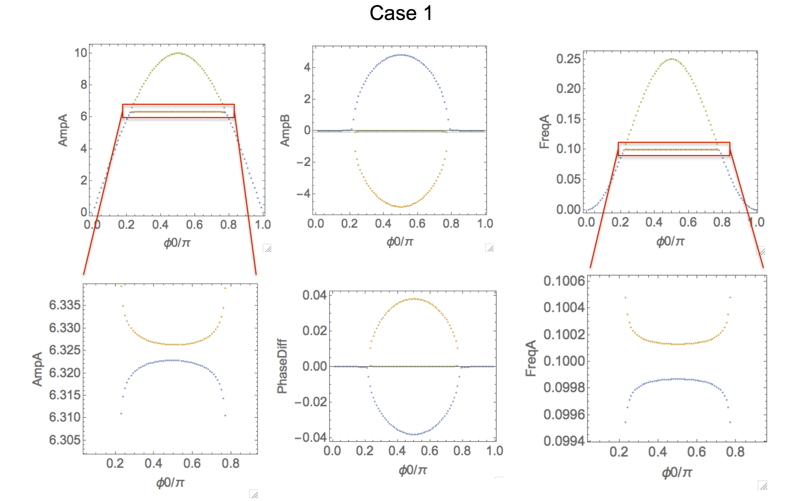
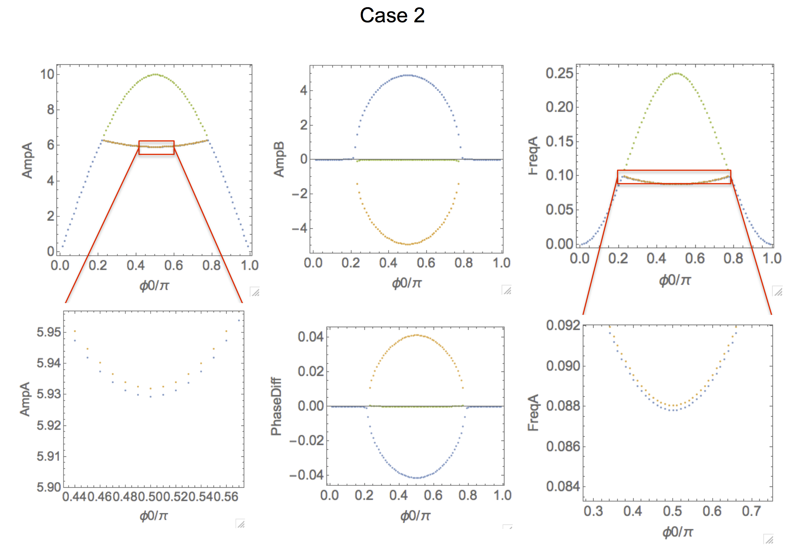
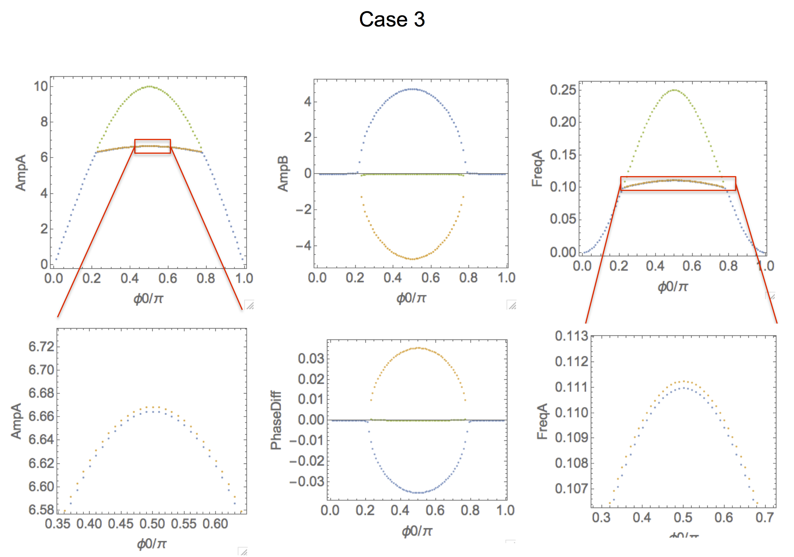
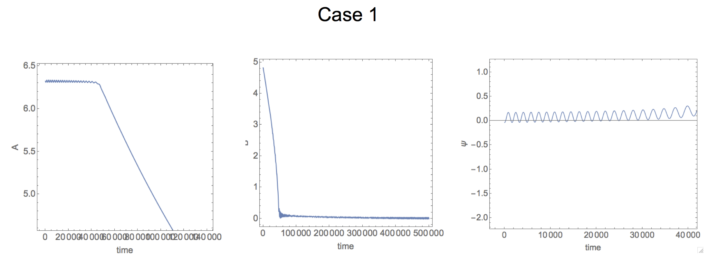
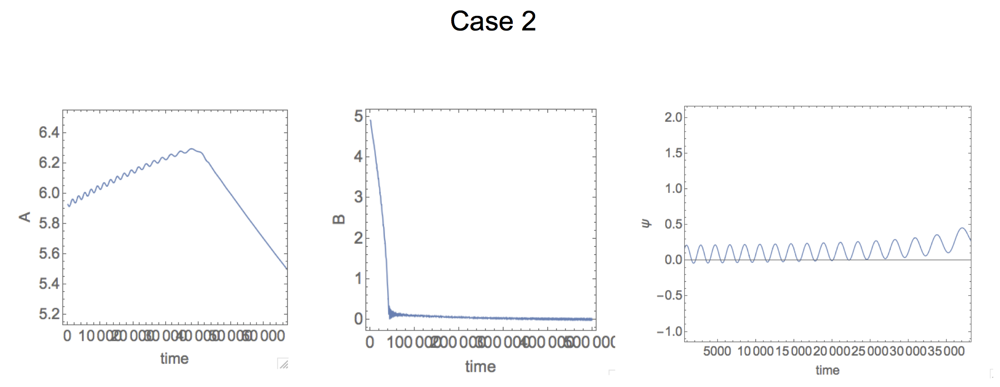
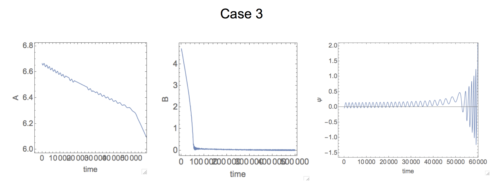

# (Potential) Figure 1 
The purpose of the following text is to document the thinking process and the details to create the figure 1 for the intended PRL paper on IR ringdown. 

## The model
The underlying model is very similar to what we have been using: a nonlinear oscillator (denoted as mode $x_1$) coupled to another oscillator (denoted as mode $x_2$). This time, the difference is that we consider a more general case that mode $x_2$ is allowed to be nonlinear as well. Putting things into equations, the model becomes:
$$
\ddot{x}_1 + \gamma_1 \dot{x}_1 + x_1 + \frac 4 3 \beta_1 x_1^3 = F_\text{ext} + J_{21} x_2
$$
$$
\ddot{x}_2 + \gamma_2 \dot{x}_2 + \Omega_2^2 x_2 + \frac 4 3 \beta_2 x_2^3 = J_{12} x_1
$$
Let me unpack the above equations. First, we are assuming the effective masses of the two modes are the same, hence they are simply scaled out. Next, the time scales of the above equations is normalized to the linear resonant frequency of mode $x_1$, in another word, under such time scale, the resonant frequency of mode $x_1$ is 1. Correspondingly, the resonant frequency for mode 2, $\Omega_2$, shown in above, is scaled with respect to resonant frequency of mode 1. If $\Omega_2$ = 1, it simply means the linear resonant frequency for mode 2 is the same as mode 1. Furthermore, we are considering the case where both modes can have non-zero Duffing coefficients ($\beta_1, \beta_2 \neq 0$), whose values can be either positive or negative. The coupling between the two modes are considered linear, which is the simpliest case. Only mode 1 receives external force, whose amplitude and frequency are either pre-determined (open-loop case), or determined self-consistently (closed-loop case).

## Solving for the model, steady-state
Now we written down the model equations, the next step is to find the solutions. There are two types of solutions that we are interested in: steady-state (s.s.) and transient. The former describes whether there will be a stable oscillation, for either/both mode 1 and mode 2, and the latter will describe how we can get to the steady-state, and more importantly, how the model will depart from the steady-state, $i.e.$ ringdowns. It it worth noting that, in order to examine the ringdown, one needs to solve for the steady-state solution first, which will be used as the initial conditions.

In order to solve for the s.s. solutions analytically, we are going to make some assumptions. To be clear, these assumptions will allow us to perform some arithmetic operations (hence, analytical), until a point that we will evoke numerical procedures to arrive at the final solutions. This scheme is much better than brutely applying the numerical procedures at the outset, for which can be time-consuming, and bears no physcial insight. 

The assumptions are the same as we made in the 2016 PRL paper, namely:

1. $\beta_1$ > 0, such that the oscillation frequency of mode 1 can be tuned upwards
* The linear resonant frequency of mode 2, $\Omega_2$, is slightly larger than 1, $i.e.$, $\Omega_2 = 1 + \nu$
* The external force, $F_\text{ext}$, is derived from the responses of the system itself, $i.e.$, we are considering closed-loop case, and the phase of $F_\text{ext}$ can be controlled, and is used to tune the oscillation frequency of mode 1
* We are only considering the solution where mode 1 and mode 2 have the ***same*** frequency

Equipped with these assumption, we can move on to perform some arithmetic operations. The details are outlined in the Supplementary Information (SI) of our 2017 Nature Commun. paper, Supplementary Note 3 (SN 3). Briefly, we assume the solution of mode 1 as $x_1(t) = A(t) \cos{[t + \alpha(t)]}$, and the solution of mode 2 as $x_2(t) = B(t) \cos{[t + \zeta(t)]}$, in which $A, B, \alpha, \zeta$ are all functions of $t$, but they change slowly such that we will only consider their first order time derivatives. In another word, terms like $\text{d}^2 A / \text{d} t^2$ are zero. 

According to the assumption 3 above, we will treat $F_\text{ext}$ with the same frequency as mode 1, but with an phase offset. Specifically, we will treat $F_\text{ext} = f_0 \cos{[\phi(t) + \Delta]}$, where $\phi(t) = t + \alpha(t)$, and $\Delta$ is a constant value that controlled by the experimenter. This will be the controlled paramter that allows one to set different s.s. conditions. 

After these manipulations, we can will arrive at the s.s. solutions for {$A, B, \alpha, \zeta$} for different $\Delta$. Let me do one more trick, is that I will be looking at {$A, B, \omega, \eta$} for different $\Delta$, where $\omega = \text{d} \phi / \text{d} t$, and $\eta = \zeta - \alpha$. Here $\omega$ is the s.s. oscillation frequency for both mode 1 and mode 2 (since they are the same, per assumpion 4 above), and $\eta$ is the phase different between mode 2 and mode 1. The physical meaning of $\eta$ is interpreted as the direction of energy flow: a positive $\eta$ means the phase of mode 2 is leading that of mode 1, therefore, mode 2 is ***sending*** energy to mode 1, and vice versa. 

The final form of the arithmetic operation is shown as equations 9 in the SI of the 2017 Nature Commun. paper, and they mark the end of analytical manipulations. From here on, I will evoke numerical perocedures (Mathematica), to solve the values of {$A, B, \omega, \eta$} for different $\Delta$. The script is located in the `scripts` folder, named `!==nonlinear MEMS calculations steady state 1to1.nb`. In this specific script, I've assigned the values of $J_{21}, J_{12}, \beta_1, \beta_2, f_0$ to be the best combination, such that we can best demonstrate the characteristics of the coupled-mode system. Note that, in the script, $J$ is $J_{12}$ in the model described here, $J'$ is $J_{21}$, $\phi0$ is $\Delta$, $\beta$ is $\beta_1$, $\rho$ is $\beta_2$, and $\psi$ is $\eta$. 

Let me highlight some representative cases. First let me consider the "poster-child" case where mode 2 is ***linear***, and I tune the value of $\Delta$ (or equivalently, $\phi0$) to access IR. The result is shown below: the second row is the zoom-in views of the corresponding figures in the first row, except for the middle figure in the second row. 

It is clear that, for some values of $\Delta$ (or equivalently, $\phi0$), there are multiple (three) s.s. solutions (marked with different colors). It turns out only two of them are stable, $i.e.$, observable in experiments. In this specific case, the stable solutions are the blue and green branches. The discussion of stability is beyond the scope of discussion here, but if it is needed, it can be obtained. 

The most interesting values of $\Delta$ (or equivalently, $\phi0$) here are around $\pi/2$, where we can see that $B$ has positive value (the blue solution). This simply means that mode 2 is excited. This is further supported by the fact the phase difference is negative for the blue branch. According to our interpretation of the phase difference, it means mode 1 is sending energy to mode 2, such that mode 2 can be built. Here, the blue branch is what we called IR, since its oscillation frequency is ***very close to, but below*** the linear resonant frequency of mode 2 (set to 1.1 here), and this branch is mirrored by the unstable (yellow) branch. 

Now let me consider a different case, called case 2. The difference here is that, I will allow $\beta_2$ (or equivalently, $\rho$) become ***negative***. This case corresponds to our experimental condition that mode 2 (torsional mode, with softening Duffing nonlinearity) is driven nonlinearly. 

The most striking difference between case 2 and case 1 is that, the frequency of the blue and yellow branches are no longer mirroring each other (with respect to the linear resonant frequency of mode 2), but both of them are bending downwards. Same behavior can be found in the $A$ vs $\Delta$ (or equivalently, $\phi0$) figure. 

The question is why? This downward bending can be understood due to the softening Duffing nonlinearity of mode 2. As mode 2 is being built (as $B$ is increasing), the Duffing nonlinearity kicks in, downshifting its oscillation frequency from its linear value (set to 1.1 here), therefore, for s.s., the IR frequency will be downshifted as a result. The amount of downshifting of IR frequency is proportional to how "nonlinear" mode 2 is. Therefore, the larger the value of $B$, the more the downshift of IR frequency. This is consistent with what we are seeing here.  

In order to validate my hypothesis, I will consider another case, in which $\beta_2$ (or equivalently, $\rho$) is ***positive***. In this case, both $A$ vs $\Delta$ (or equivalently, $\phi0$), and FreqA vs $\Delta$ (or equivalently, $\phi0$) should buckle up. Not surprising, it is what we see. 

## Solving for the model, ringdown

Now we have obtained the s.s. solutions, and explored some parameter space, we can move to simulate the rindown responses. This will be a purly numerical exercise since it is impossible to obtain analytical solutions. Again, the numerical simulations are carried out with Mathematica, and the script is saved in the `scripts` folder, named `!=nonlinear MEMS calculations transient 1to1.nb`. 

Let me run the ringdown simulations for all the three cases in the s.s. section, so that we have a good correspondence. In order to keep things simple, I will choose the value of $\Delta$ (or equivalently, $\phi0$) to be $\pi/2$, in the hope that it will "amplify" the effects of the IR the most. I will be focusing on three datasets: $A$ vs $t$, $B$ vs $t$, and $\eta$ vs $t$.

From the above results, it is clear that, by varying the values (or signs) of $\beta_2$ (or equivalently, $\rho$), one can control the "slope" of $A$ vs $t$ during coherent time. This again, can be understood through the how the nonlinearity of mode 2 affects IR. Take the case 2, where $\beta_2$ (or equivalently, $\rho$) is negative as example: at s.s., which is the initial condition for the ringdown, mode 2 is driven nonlinearly, hence the IR frequency is below $\nu$. Once the ringdow starts, the amplitude of mode 2, $B$ starts to decrease, and so its oscillation frequency, and, so is the IR frequency. Recalling the s.s. picture, $c.f.$, $A$ vs $\Delta$, it is like (this is a big jump in logic) travelling from $\Delta = \pi/2$ (the initial condition) to a smaller $\Delta$ value. In such process, $A$ actually becomes larger, until the end of coherent time.  

