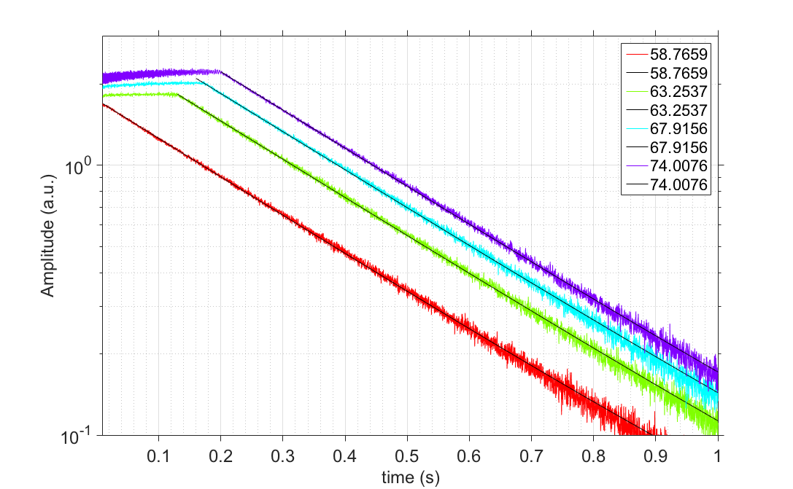

# (Potential) Figure 2
The purpose of the following text is to document the thinking process, details, data, and scripts that are intended to create figure 2. 

1. [Different types of data](#1)
2. [The locations of the data](#2)
3. [Choices of the nonlinear ringdown data and initial analysis](#3)
4. [Frequency domain analysis](#4)

## Different types of data 
In this figure, we want to show the ringdown data that reflect the model predictions, as presented in figure 1. Specifically, we can show the following types for ringdown:

1. Ringdown of a "normal" nonlinear oscillator, that is, a nonlinear, self-sustained, closed-loop, oscillator being driven to a steady-state, and then the power-supply (feedback force / voltage) is turned off.
2. Ringdown at IR, but with **practically constant** amplitude (amplitude is defined as the envelope of the oscillation) during $t_\text{coherent}$. This corresponds to the case where "mode 2" was driven (during s.s.) linearly.
3. Ringdown at IR, but with **increasing** amplitude during $t_\text{coherent}$. This corresponds to the case where "mode 2" was driven (during s.s.) nonlinearly. In our case, the "control knob" to determine whether mode 2 was linear or nonlinear (at s.s.) is the feedback phase delay $\Delta$. This phase delay effectively controls the amplitude of the feedback force (think of the effective feedback force as the **in-phase** component of the feedback signal).
4. Potentially, we can show the ringdown of a linear **resonator**. In this situation, we are dealing with open-loop configuration (but same device, same DC bias), and we only have the amplitude (*i.e.* envelope of the oscillation), instead of the oscillation itself. This is due to the fact that such ringdown is acquire by lock-in amplifier in order to mitigate the small signal-to-noise ratio (SNR).

## The locations of the data 
The data are taken from the "hero" device, a.k.a, `ARG_S13_3_cIII`. All the experimental data are saved on the portable hard drive, under the path `/Noise/Data/ARG/S13/3/`. The "unfortunate" root folder (`Noise`) was named since I thought the projects will be centered around noise analysis.

If we zoom in the data of interest there, they are saved under the path `/Noise/Data/ARG/S13/3/DC_bias`. In that folder, there are all the raw data, as well as `Matlab` scripts used to process the data. Additional files are: summary slides (both in `.pptx` and `.pdf` formats), and Wyko surface profice to show the (lack of) center-beam buckling due to large DC bias. 

For the sake of this exercise, I will copy the key `Matlab` scripts into the `scripts` folder that resides in the same folder of this document. The name is `fig2_explanation.m`. This script covers all the three nonlinear types, and I will then call and load the raw data from its original path, *i.e.*, from the portable hard drive. The ringdown of the linear resonator is saved under the path of `/Noise/Data/ARG/S13/3/DC_bias_Qs/zi/`, in which there are data taken with different DC bias. 

## Choices of the nonlinear ringdown data and initial analysis 
For the nonlinear ringdown data, there are two "control knobs": feedback phase delay ($\Delta$), and DC bias. Therefore, it makes more sense to compare different data while varying only one of these two parameters. The preferable one to change is $\Delta$. In this way, we can assume the lienar $Q$ is not changed, therefore simplify the analysis. 

Now we have decided to vary $\Delta$, the question becomes, at which (fixed) DC bias shall we vary $\Delta$? Keep in mind that we are going to highlight two aspects: (1) the slope of the amplitude during $t_\text{coherent}$ can be either zero or positive; and (2) there are oscillations of the amplitude during $t_\text{coherent}$. With these two considerations in mind, I went in to the summary slide (`/Noise/Data/ARG/S13/3/DC_bias/ARG_13_3_DC_bias_summary_v4.pptx`), and my choice of DC bias is **9 V**. (6 V is a close contender). For DC bias of 9 V, there are 4 different $\Delta$, with one of them will give me the "normal" ringdown. Below we can see the amplitude of the 4 different ringdowns all together, with y-axis offseted (hence the unit for the y-axis is a.u.). 

In the figure we also have exponetial fits for each data, for the $t > t_\text{coherent}$ portion. Although not showing here, all the 4 fits give the exponetial decay time constant of 0.301 ~ 0.305 seconds (fittings are included in the `Matlab` script). The legend shows the calculated values of $\Delta$.

Now let me pick the obviously most interesting data, which is the purple one (with increasing amplitude during $t_\text{coherent}$, and zoom in. To make thing clear, I will through in the original oscillation as well, in order to: (1) show our envelope extraction is accurate, and (2) the original oscillation is continuous. 

## Frequency domain analysis 
Let me focus on the previous dataset, and turn my eyes to the frequency domain. The reason is that, we can see that, the period of the amplitude oscillation gets longer as we progress during $t_\text{coherent}$. This should corresponds to our previous observation in the frequency domain (cf. figure 4 in the Nature Commun. paper), in which the two sidebands merge toward main peak. In fact, the appearance of the sideband can be explained by the amplitude oscillation, therefore, if the period of the amplitude oscillation gets longer, we should naturally expect the sidebands gets closer. 

It will be nice to confirm this, given that now we have such clean amplitude oscillation observed. The procedure is to first get the amplitude v.s. time, and then using `Matlab`, I will simply count the time difference ($t_{i+1} - t_{i}$) between adjcent peaks $i$ and $i+1$ (hence the period), and caculate the frequency (= 1/period), and assign this beat frequency as the upper sideband of the main frequency, at time $\frac 12(t_{i+1} + t_{i})$. In this way, I can obtain sideband frequency v.s. time mechanically from the time-domain data. In the meantime, I will evoke the old trick, to perform temporal FFT, which will also gives me the sidebands. Then I will just simple overlay them, as shown below. The corresponding script is also saved in the `scripts` folder, with the name `fig2_explanation_beating.m`.

There are more we can say from the above figure. First, for the $t < 0$ portion, we can see the sidebands are already there, from both time domain (white circles) and frequency domain analysis. Second, there are even signs of higher-order sidebands emerging, which I have no explanations yet.

