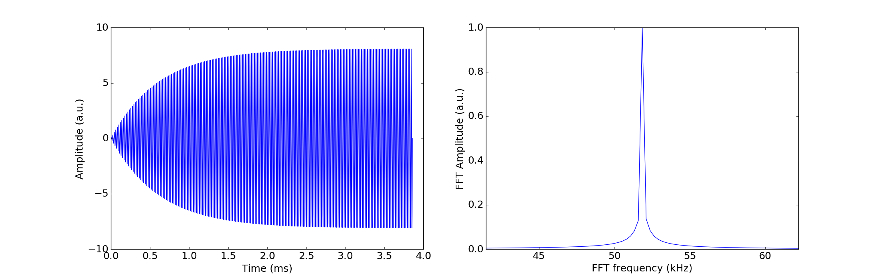

# Exploration for the Internal Resonance under Thermal Noise
The idea of this exploration is to see whether one can achieve Internal Resonance (IR), and obtain the benefits of IR that we have seen (*e.g.* frequency stabilization, coherent time) in such case. This will mostly be numerical calculations. 

## Baseline study: Damped driven oscillator (w/o thermal noise)
### Problem setup
Let's first build a simple case that is very well understood, just to make sure I have the numerical procedures setup correctly. The case we are considering here is the motion $x$ of a driven damped oscillator, governed by the equation of motion:

$$m \ddot{x} + m \gamma \dot{x} + kx = F_d\cos{(2\pi f_d t)},$$

here, $m$ is the mass of the oscillator, $\gamma$ is the damping ratio, $k$ is the spring constant, $F_d$ is the amplitude of the external drive, and $f_d$ is the frequency of the external drive. As it stands, the oscillator is only under a coherent external drive, *i.e.* there is no noise involved. All the quantities are assumed to have SI units. 

This equation can be quite easily solved, by guessing the solution has the form of $x(t) = A \cos{(\omega t)}$, there is no award for getting this result. My goal here, however, is to solve the time-domain ordinary differential equation (ODE) using brutal force, *i.e.* with numerical integration technique, and to arrive at the same result. 

To make the example more concrete, I will assume a doubly clamped silicon beam as my model oscillator. The dimension of the beam is $w \times h \times L$ (width, thickness and length, respectively). The mass can then be determined from the volume. The spring constant $k$ and resonant frequency $\omega_0$ is then:

$$k = \frac{E w h^3 L }{12} (\frac{1.875}{L})^4,~~~
\omega_0 = \sqrt{\frac{k}{m}},$$

where $E$ is the Young's modulus (for silicon in this case), and $1.875~/~L = \beta_1$ is determined by the boundary conditions. The damping ratio $\gamma$ will be *arbitrary* assigned by me, from a corresponding quality factor $Q$, such that $\gamma = \omega_0~/~Q$. 

Now I am geared up with all the intrinsic properties of the oscillator, the next step will be assign a suitable external drive condition, and observe how $x$ evolves as a function of time $t$.  

### Numerical procedures
I am using `python` with `numpy` and `scipy` packages for the numerical procedures. Since this is a deterministic problem (no noise), I will use the `integrate.odeint` function from `scipy` to solve for $x(t)$. Reference to the function can be found [here](https://docs.scipy.org/doc/scipy/reference/generated/scipy.integrate.odeint.html). Furthermore, I've written a quick function to take fast Fourier Transform (FFT) of any time-series data, which I will apply to the $x(t)$, just to make sure things behave as expected. Below are the results. In this case, the drive frequency $f_d$ is set equaled to $f_0 \approx 51.8$ kHz. The initial conditions for $x$ and $\dot{x}$ are both zero.

So far, it looks like the numerical procedure is behaving correctly. There are more things that I can do *pure* numerically, such as producing the resonant spectrum (by varying the $f_d$ and extract the steady-state oscillation amplitude at each $f_d$), but I am not going to... I could also simulate a nonlinear oscillator (*e.g.* Duffing-type) by modifying the governing equation, which I will probably return to later. 

## Damped oscillator driven by thermal noise
### Nature of the stochastic force
Now I've tested the numerical procedure, I can move on to simulate the case where the oscillator is only driven by thermal noise. In this case, the governing equation becomes: 

$$m \ddot{x} + m \gamma \dot{x} + kx = F_N (t),$$

where $F_N(t)$ represents the stochastic force arisen from thermal bath. On the face of it, this is a [stochastic differentical equation (SDE)](https://en.wikipedia.org/wiki/Stochastic_differential_equation), and in physics, this is also known as [Langevin equation](https://en.wikipedia.org/wiki/Langevin_dynamics). We are saying that $F_N(t)$ is stochastic, *i.e.* random, but what properties that we can rely on to get some useful information about the dynamics of the oscillator? First of all, this force arises due to the interaction between the oscillator and the gazillion-degrees-of-freedom in the environment (thermal bath), however, on average, this thermal force is zero:

$$<F_N(t)> = 0,$$

this is not very useful. Instead, we should look into the second moment of the thermal force, which must satisfy:

$$2 m k_B T \gamma = \int_{-\infty}^{\infty}<F_N(0)F_N(u)> \text{d}u,$$

where $k_B$ is the Boltzmann constant. The above equation can be further simplified to:

$$<F_N(t)F_N(t')> = 2 m k_B T \gamma \delta(t-t').$$

Now we can start talking about the *power spectrum* of the thermal force, which is defined as the Fourier transform of the *correlation function K(s)* of the force. The latter is defined as:

$$K(s) = <F_N(t)F_N(t+s)> =  2 m k_B T \gamma \delta(s),$$

which is the *ensemble average* of the product of forces at time $t$ and $t+s$. One way to think about it is that, given the time-series is infinity long, and I will keep $s$ fixed. Then I will pick $t$ randomly from this time-series, and compute $<F_N(t)F_N(t+s)>$. I can do this with many different $t$, and $<...>$ means the average of all these computations. The spectral density, $S_F(\omega)$ of the correlation function is then:

$$S_F(\omega) = \frac{1}{2\pi} \int_{-\infty}^{\infty}K(s) e^{-i\omega s} \text{d}s
= \frac{1}{2\pi} \int_{-\infty}^{\infty} 2 m k_B T \gamma \delta(s) e^{-i\omega s} \text{d}s
= \frac{1}{2\pi} 2 m k_B T \gamma \delta(0) e^{-i\omega 0}
= \frac{m k_B T \gamma}{\pi}.$$

Note that the prefactor $1/2\pi$ is by convention (see [here](https://en.wikipedia.org/wiki/Fourier_transform#Other_conventions)). 

How this information can help us in this case, though we haven't touched the simulation in time domain yet?

### Time domain simulation
This is all nice, but it doesn't help me to simulate the *time domain* response! In simulating the previous deterministic case, at time step $t_i$, I have a well-defind value of force at time step $t_i + \Delta t$. In this case, what should I use? Shall I just throw in, say, a normally distributed value? At least normal distributed noise has a mean of zero. 

Hence I modified the `python` script to apply the random force. Now the function definition returns:

~~~python
  return [
            Y[1], 
            (
            -(k * Y[0] + (m * omega0 / Q) * Y[1] + beta*Y[0]**3)  # internal dynamic 
            + force_d * np.cos(2*np.pi*f_d*t)  #  coherent drive
            + 10*np.random.normal(0, 1)  #  thermal noise
            ) / m           
            ]
~~~	

However, solving this function with `integrate.odeint` gives me the warning of `Excess work done on this call (perhaps wrong Dfun type)`. After a bit of reading, it turns out that the discontinous nature of `np.random.normal(0, 1)` is the culprit: for `integrate.odeint` to work well, the ODE needs to be (in this case, first-order) differentiable. In this case, there are discrete jumps between each time step, hence making the problem very 'stiff'. 

#End